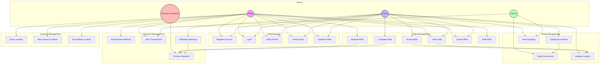

```mermaid
graph TB
    subgraph Actors
        Rider((Rider))
        Driver((Driver))
        Admin((Admin))
        PaymentGateway((Payment Gateway))
    end

    subgraph Authentication
        Register[Register Account]
        Login[Login]
        VerifyPhone[Verify Phone]
        VerifyEmail[Verify Email]
        UpdateProfile[Update Profile]
    end

    subgraph Ride Management
        RequestRide[Request Ride]
        AcceptRide[Accept Ride]
        TrackRide[Track Ride]
        CompleteRide[Complete Ride]
        CancelRide[Cancel Ride]
        RateRide[Rate Ride]
    end

    subgraph Payment Management
        AddPaymentMethod[Add Payment Method]
        ProcessPayment[Process Payment]
        ViewTransactions[View Transactions]
        WithdrawEarnings[Withdraw Earnings]
    end

    subgraph Driver Management
        UploadDocuments[Upload Documents]
        VerifyDocuments[Verify Documents]
        UpdateLocation[Update Location]
        ViewEarnings[View Earnings]
    end

    subgraph Location Management
        SaveLocation[Save Location]
        ViewSavedLocations[View Saved Locations]
        SetDefaultLocation[Set Default Location]
    end

    %% Rider Use Cases
    Rider --> Register
    Rider --> Login
    Rider --> VerifyPhone
    Rider --> VerifyEmail
    Rider --> UpdateProfile
    Rider --> RequestRide
    Rider --> TrackRide
    Rider --> CancelRide
    Rider --> RateRide
    Rider --> AddPaymentMethod
    Rider --> ViewTransactions
    Rider --> SaveLocation
    Rider --> ViewSavedLocations
    Rider --> SetDefaultLocation

    %% Driver Use Cases
    Driver --> Register
    Driver --> Login
    Driver --> VerifyPhone
    Driver --> VerifyEmail
    Driver --> UpdateProfile
    Driver --> AcceptRide
    Driver --> TrackRide
    Driver --> CompleteRide
    Driver --> CancelRide
    Driver --> UploadDocuments
    Driver --> UpdateLocation
    Driver --> ViewEarnings
    Driver --> WithdrawEarnings

    %% Admin Use Cases
    Admin --> VerifyDocuments
    Admin --> ViewTransactions
    Admin --> ViewEarnings

    %% Payment Gateway Use Cases
    PaymentGateway --> ProcessPayment

    %% System Relationships
    RequestRide --> ProcessPayment
    CompleteRide --> ProcessPayment
    WithdrawEarnings --> ProcessPayment
    UploadDocuments --> VerifyDocuments
    AcceptRide --> UpdateLocation
    TrackRide --> UpdateLocation

    style Rider fill:#f9f,stroke:#333,stroke-width:2px
    style Driver fill:#bbf,stroke:#333,stroke-width:2px
    style Admin fill:#bfb,stroke:#333,stroke-width:2px
    style PaymentGateway fill:#fbb,stroke:#333,stroke-width:2px
``` 