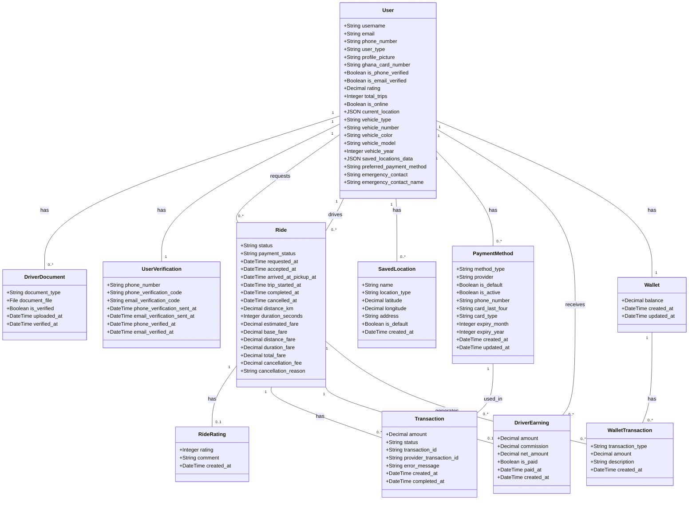

```mermaid
classDiagram
    class User {
        +String username
        +String email
        +String phone_number
        +String user_type
        +String profile_picture
        +String ghana_card_number
        +Boolean is_phone_verified
        +Boolean is_email_verified
        +Decimal rating
        +Integer total_trips
        +Boolean is_online
        +JSON current_location
        +String vehicle_type
        +String vehicle_number
        +String vehicle_color
        +String vehicle_model
        +Integer vehicle_year
        +JSON saved_locations_data
        +String preferred_payment_method
        +String emergency_contact
        +String emergency_contact_name
    }

    class DriverDocument {
        +String document_type
        +File document_file
        +Boolean is_verified
        +DateTime uploaded_at
        +DateTime verified_at
    }

    class UserVerification {
        +String phone_number
        +String phone_verification_code
        +String email_verification_code
        +DateTime phone_verification_sent_at
        +DateTime email_verification_sent_at
        +DateTime phone_verified_at
        +DateTime email_verified_at
    }

    class Ride {
        +String status
        +String payment_status
        +DateTime requested_at
        +DateTime accepted_at
        +DateTime arrived_at_pickup_at
        +DateTime trip_started_at
        +DateTime completed_at
        +DateTime cancelled_at
        +Decimal distance_km
        +Integer duration_seconds
        +Decimal estimated_fare
        +Decimal base_fare
        +Decimal distance_fare
        +Decimal duration_fare
        +Decimal total_fare
        +Decimal cancellation_fee
        +String cancellation_reason
    }

    class RideRating {
        +Integer rating
        +String comment
        +DateTime created_at
    }

    class SavedLocation {
        +String name
        +String location_type
        +Decimal latitude
        +Decimal longitude
        +String address
        +Boolean is_default
        +DateTime created_at
    }

    class PaymentMethod {
        +String method_type
        +String provider
        +Boolean is_default
        +Boolean is_active
        +String phone_number
        +String card_last_four
        +String card_type
        +Integer expiry_month
        +Integer expiry_year
        +DateTime created_at
        +DateTime updated_at
    }

    class Transaction {
        +Decimal amount
        +String status
        +String transaction_id
        +String provider_transaction_id
        +String error_message
        +DateTime created_at
        +DateTime completed_at
    }

    class DriverEarning {
        +Decimal amount
        +Decimal commission
        +Decimal net_amount
        +Boolean is_paid
        +DateTime paid_at
        +DateTime created_at
    }

    class Wallet {
        +Decimal balance
        +DateTime created_at
        +DateTime updated_at
    }

    class WalletTransaction {
        +String transaction_type
        +Decimal amount
        +String description
        +DateTime created_at
    }

    User "1" -- "0..*" DriverDocument : has
    User "1" -- "1" UserVerification : has
    User "1" -- "0..*" Ride : requests
    User "1" -- "0..*" Ride : drives
    User "1" -- "0..*" SavedLocation : has
    User "1" -- "0..*" PaymentMethod : has
    User "1" -- "0..*" DriverEarning : receives
    User "1" -- "1" Wallet : has

    Ride "1" -- "0..1" RideRating : has
    Ride "1" -- "0..*" Transaction : has
    Ride "1" -- "0..1" DriverEarning : generates
    Ride "1" -- "0..*" WalletTransaction : generates

    PaymentMethod "1" -- "0..*" Transaction : used_in
    Wallet "1" -- "0..*" WalletTransaction : has
``` 